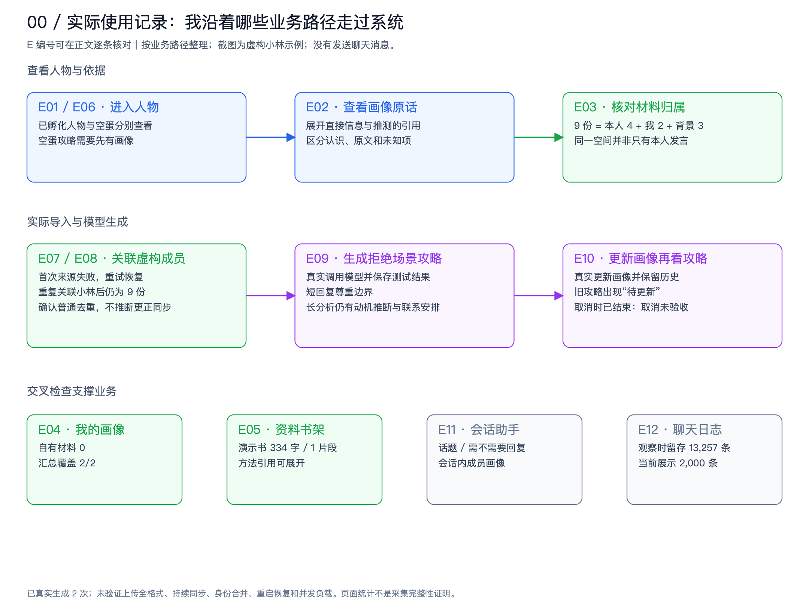

# 爱聊 · 关系牧场

一个以人物为中心的本地交流辅助应用：整理聊天材料，生成带原文依据的人物画像，结合自己的信息、当前情境和参考资料，提供可编辑的相处建议。

此仓库当前内容已由 SuperTrader 替换为爱聊；原项目仍保留在 Git 提交历史中。**当前源码是本地开发版本，依赖另行准备的 dsh-java 底座与 macOS 环境，不是克隆后即可独立启动的发行包。**

## 先看文档

- [架构评审入口](docs/README.md)：使用记录、现有架构、目标设计、修复与迁移方案。
- [完整图解文字版](docs/architecture-review-20260924/架构评审.md)：12 条体验记录、11 张图、3 张虚构示例截图、10 项修复建议。
- [离线交互阅读版](docs/architecture-review-20260924/index.html)：下载后用浏览器打开，支持分章阅读和图片放大。GitHub 文件页显示源码，不会直接运行 HTML。
- [聊天日志说明](logbook/README.md)、[飞书接入](feishu/README.md)、[微信 CLI 适配说明](wechat-cli/README-ADAPTATION.md)。

架构评审是 **2026-09-24 的评审快照**；此后源码增加了 `RanchLiveSources` 等平台来源读取能力。评审中的问题与图按当时版本理解，不能将建议视为已实施，也不能将旧流程当作最新源码的完整描述。



## 核心业务

1. **关注一个人**：创建人物，填写称呼、相处目标和补充说明。
2. **整理材料**：粘贴原文，或选择微信/飞书会话中的成员；区分对方、我的发言和背景。跨会话身份由用户确认。
3. **形成认识**：生成画像，查看直接信息、推测、原文依据、覆盖范围和待了解事项。
4. **理解自己**：维护自述、表达习惯和边界，汇总明确属于自己的材料。
5. **获得建议**：输入当前情境，结合目标人物画像、双方原始材料与书架方法生成候选回复及步骤。
6. **由人决定行动**：复制与生成都不代表发送；本应用不会自动替用户发送聊天消息。

资料书架支持 TXT、Markdown、可选中文字的 PDF、DOCX、EPUB。书籍是沟通方法来源，不能充当人物事实证据。模型分析只在用户触发相应操作时调用配置的 DeepSeek 服务，相关选定材料会随请求发送。

## 当前技术组成

| 部分 | 实现与职责 |
|---|---|
| 前端 | JavaScript、esbuild、DSH ModuleLoader、`@deepseek-ai/cordis` 页面插件 |
| 业务后端 | Java 17；dsh-java 插件宿主；JDK HttpServer；人物、材料、画像、攻略与书架 |
| 模型 | 通过底座 ModelRegistry 调用 DeepSeek；牧场使用自己的受控分析器 |
| 数据库 | PostgreSQL 保存业务数据；独立 Logbook 用 SQLite 保存日志 |
| 来源读取 | `RanchLiveSources` 按需读取平台会话；飞书插件；微信 CLI 与独立历史采集插件 |
| 框架扩展方向 | 经底座已有的 AgentScope Java 循环接入受控执行；当前应用未以此替代 RanchAnalyzer |

微信平台按需读取与独立日志导入是不同路径。按需读取当前选择的会话最近消息，受本机同步和读取上限约束；飞书受客户端已加载内容限制。人物关联不是自动订阅全部历史，也不承诺来源更正/撤销已经端到端同步。

## 目录

```text
src/                       Java 业务代码与测试
web/                       Cordis 页面、样式与前端构建
plugins/feishu-history/     飞书读取插件
plugins/wechat-history/    微信历史采集插件
ranch_sources/             平台会话按需读取适配器
logbook/                   独立日志应用与 SQLite 存储
wechat-cli/                有上游来源与许可记录的 CLI 适配代码
wechat/                    日志阅读与兼容入口
knowledge/                 书籍文字提取
docs/                      架构报告、图解和评估证据
run.py / build.sh          本地启动与构建
```

## 环境准备

需要 Java 17、Maven、Node.js/npm、Python 3、PostgreSQL，以及可用的 DeepSeek 凭据。微信/飞书和原生读取相关能力面向已配置的 macOS；Python 文件提取依赖按实际格式安装，例如 PDF 使用 `pypdf`。

**另行准备 dsh-java：** 本仓库未包含底座源码、运行制品和私有配置。必须先取得与本项目合同兼容的底座，安装 `dev.dsh` 的 `0.1.0-SNAPSHOT` Maven 合同依赖，并构建以下文件：

- `app-boot/target/dsh-java.jar`
- `plugins/model-registry/target/model-registry.jar`
- `plugins/model-deepseek/target/model-deepseek.jar`
- 前端 `frontend/src/bootstrap.js` 与 `frontend/vendor/plugins/dsh-client-modules/` 文件。

还需要与当前构建兼容的 `@deepseek-ai/cordis`（本机使用 4.0.2）及 cosmokit 文件。仅安装 AgentScope SDK 不能替代这些底座合同。

| 环境变量 | 用途 |
|---|---|
| `DSH_JAVA_HOME` | 已构建的 dsh-java 根目录 |
| `DSH_PACKAGES` | 包含 `cordis/` 与 `cosmokit/` 的 `@deepseek-ai` 包目录 |
| `MAVEN_BIN` | Maven 可执行文件路径，供 `build.sh` 使用 |
| `DEEPSEEK_API_KEY` | 仅通过启动进程环境传入模型凭据 |
| `GARDEN_DB_URL` / `GARDEN_DB_USER` / `GARDEN_DB_PASSWORD` | 独立 PostgreSQL 数据库的 JDBC URL、用户和密码；三项一起提供 |
| `GARDEN_PYTHON` | 具有文字提取依赖的 Python 路径 |
| `GARDEN_EXTRACTOR` | 可选的文字提取脚本路径，默认 `knowledge/extract.py` |
| `GARDEN_WECHAT_PYTHON` | 微信适配器 Python，默认 `wechat-cli/.venv/bin/python` |
| `GARDEN_WECHAT_SOURCE` | 本机已授权的微信来源配置路径；配置与密钥不得提交 |
| `GARDEN_PORT` | 主应用端口，默认 48740 |

脚本仍保留开发机默认路径。换电脑时需设置上述路径，不要直接照搬本机绝对路径。未提供 `GARDEN_DB_URL` 时，启动器会按原本机约定读取底座 `.local/postgres.env`，并检查 Docker 中的独立数据库；新环境建议显式配置三项数据库变量。

## 构建与运行

以下命令在仓库根目录执行，前提是上述外部依赖、数据库及环境变量已配置。凭据不要写入 Git 文件或命令示例。

```bash
# 设置 MAVEN_BIN 为本机 Maven 可执行文件，例如通过 command -v mvn 获取
export MAVEN_BIN="$(command -v mvn)"

# 构建来源插件与主应用
"$MAVEN_BIN" -f plugins/feishu-history/pom.xml package
"$MAVEN_BIN" -f plugins/wechat-history/pom.xml package
"$MAVEN_BIN" package

# 准备输出目录并构建前端
npm --prefix web ci --no-audit --no-fund
mkdir -p web/dist/vendor
npm --prefix web run build

# 从当前终端继承模型与数据库环境变量
python3 run.py
```

主入口：<http://127.0.0.1:48740/>；旧会话材料：<http://127.0.0.1:48740/conversations.html>。停止时在运行终端按 `Ctrl+C`。

独立日志使用 `python3 logbook/launch.py`，具体初始化和原生依赖见 [Logbook 文档](logbook/README.md)。48741 为日志阅读入口，48742 为独立日志服务；启动主应用不等于这些服务都已启动。微信密钥初始化、客户端权限和本机数据库由用户在自己的设备上配置，仓库不携带这些状态。

## 测试与评估

```bash
"$MAVEN_BIN" test
"$MAVEN_BIN" -f plugins/feishu-history/pom.xml test
"$MAVEN_BIN" -f plugins/wechat-history/pom.xml test
node --test web/src/*.test.js
```

Python 测试分布在 `logbook/tests`、`feishu/tests`、`wechat/tests`、`wechat-cli/tests`、`ranch_sources` 和 `knowledge`，需按组件配置依赖。以上是运行入口，不意味着 Git 接入时已经完成全平台、真实模型或真实客户端验收。

[内存评估探针](docs/evidence/AssessmentProbe.java)和[结果](docs/evidence/probe-results.json)记录评审时的四个反例，不是未来版本必然保持不变的测试结论。

## 本地 Git 与数据范围

当前本机工作副本就是正在使用的爱聊目录，远端为 `https://github.com/hj456992/SuperTrader.git`，分支为 `main`。Git 管理源码、构建清单、测试和文档；不包含模型密钥、数据库密码、聊天数据库、采集缓存、运行状态、虚拟环境和构建产物。首次克隆不会获得开发机已保存的聊天、人物资料或书架数据。

```bash
git status
git diff
git add <明确修改的源码或文档>
git commit -m "说明这次修改"
git push origin main
```

`.gitignore` 已配置常见本地数据路径。提交前仍应检查暂存区，避免手工导出的聊天或凭据使用了其他文件名。

## 许可与第三方来源

见 [THIRD-PARTY-NOTICES.md](THIRD-PARTY-NOTICES.md)、[微信 CLI 上游信息](wechat-cli/UPSTREAM_SOURCE.json)、[上游 LICENSE](wechat-cli/LICENSE)及[适配代码许可](wechat-cli/ADAPTER_LICENSES.md)。外部 dsh-java 和 DSH 包不作为本次源码上传的一部分；不能将某个第三方组件的许可推断为整个仓库的许可。
