> 归档评审快照：2026-09-24。此报告形成后，本地又增加了 RanchLiveSources 等平台读取代码；其中现状图与结论以评审时点为准，不表示上传版本已完成这些修复。当前启动与目录说明见仓库 README。

# 爱聊：业务理解与架构修复图解

**评审日期：2026-09-24｜对象：当前本地爱聊与本机 dsh-java 底座｜状态：评审与目标设计，尚未实施产品改造。**

爱聊的核心价值，是把散落在会话里的信息组织成对一个人的、可以修正的认识，再结合自己的情况和当前情境提出相处建议。因此，架构的主线应当是 **来源事实 → 人物关联 → 有依据的认识 → 情境建议 → 人的行动与反馈**。页面、模型和插件都应服务这条主线。

本次建议保留现有牧场入口、Java 底座和本地采集能力，把系统逐步改造成**事实可追溯、派生结果可失效、任务可恢复的模块化单体**。Cordis 管模块组合和生命周期；DSH 管模型、工具、会话与执行装配；AgentScope 在底座内部承担受控模型执行；爱聊自己掌握身份、证据和结果提交规则。

> 阅读顺序：先看第 1 节体验记录与图 01，再看图 02–06 的现状，最后看图 07–10 与修复方案。图上注明“目标设计”的内容均未实现。蓝色表示业务调用，绿色表示事实/存储，紫色表示模型/异步执行，红色表示取消或撤销。

## 1. 我实际怎样使用了这个系统

这些记录来自上一轮的实际操作，以及本轮对小林示例的只读复查。编号按业务路径编排，不是逐秒操作录像。截图为本轮真实界面，内容限于虚构示例。没有把真实群聊送入本次模型分析，也没有代用户发送任何消息。


| 记录 | 我执行的路径 | 看到的具体结果 | 由此确认的业务逻辑 |
|---|---|---|---|
| E01 | 首页 → 已孵化人物 / 未孵化蛋 | 观察时有 4 位人物，1 位已孵化；小林有画像，空蛋没有 | 首页围绕“关注的人”组织；孵化是展示状态 |
| E02 | 小林 → 画像 → 展开依据 | 有直接信息、推测、未知；引用可展开到样例原话 | 画像是从材料产生的认识，应允许纠正和过期 |
| E03 | 小林 → 了解材料 | 9 份：本人 4、我 2、背景 3 | 同一人物空间包含多个说话人的材料，不能把空间归属等同于证据主体 |
| E04 | 我的画像 → 查看材料与覆盖 | 自有材料显示 0，保存画像显示覆盖 2/2 | 自我信息还会汇总其他人物空间里的“我”；计数口径不同 |
| E05 | 资料书架 → 查看演示资料 | 1 份自编资料、334 字、1 个片段；攻略的知识参考能展开 | 书架是建议的方法来源，不是人物事实来源 |
| E06 | 新朋友蛋 → 相处攻略 | 有情境入口，但生成按钮禁用，要求先有有效画像 | 当前短期建议依赖长期画像；这是一项现有用例约束 |
| E07 | 关联聊天 → 首次读取 → 重新加载 | 首次出现来源读取失败；重试恢复 | 来源能力可能暂时不可用，但人物空间仍可访问；需区分能力可用性 |
| E08 | 微信 → 虚构摄影群 → 小林 → 重复关联 | 可选成员及其消息；导入成功后仍为 9 份 | 关联以“会话内成员”为选择单位；普通重复复制会去重 |
| E09 | 输入明确拒绝邀约的虚构情境 → 生成攻略 | 真实模型结果保存；短回复尊重拒绝，长分析仍有动机推断和再次联系安排 | 好的语气不能替代对证据与情境约束的校验 |
| E10 | 小林 → 更新画像 → 返回攻略 | 新画像保存并留下历史；原攻略显示“待更新” | 画像是攻略的依赖，变化会使既有攻略失效；本轮截图复核了这一点 |
| E11 | 聊天材料 → 虚构摄影群 → 交流助手 | 看到话题、是否需要回复、重点关注、会话内成员画像 | 旧会话助手和新跨会话人物系统并存，是两个业务范围 |
| E12 | 聊天日志 → 查看采集与阅读范围 | 当时页面显示 13,257 条原文、27 成员、37 批次，当前展示 2,000 条 | 日志留存、页面展示、人物导入、模型选材是四种覆盖范围 |

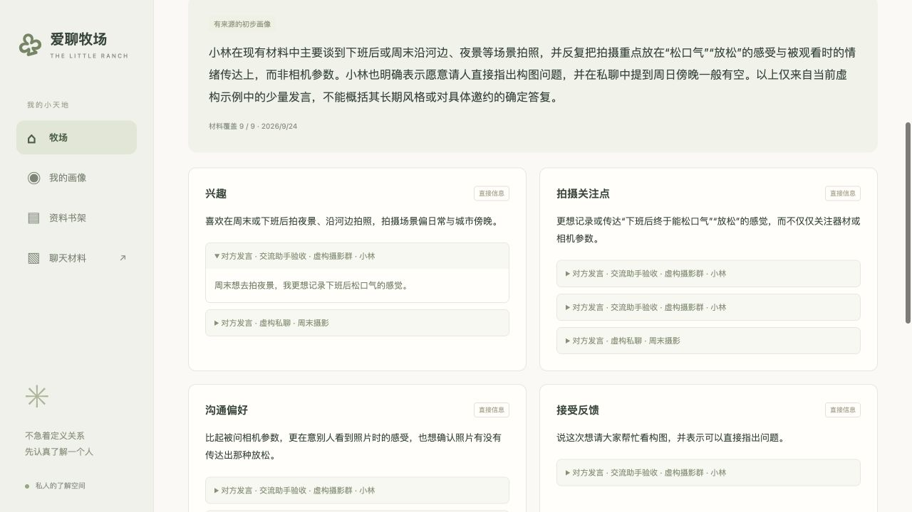

**E02 的判断重点：** 能点开依据，只证明系统知道自己引用了哪段文字；还需要判断文字是否真的支持那条认识。

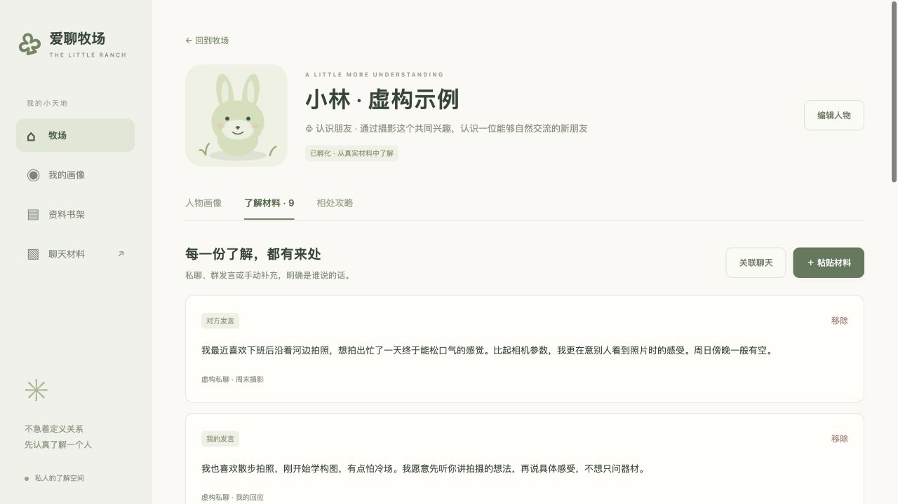

**E03 的判断重点：** 材料必须有独立的说话人和来源标识。“放在小林空间中”不能把用户或旁人的话变成小林的观点。

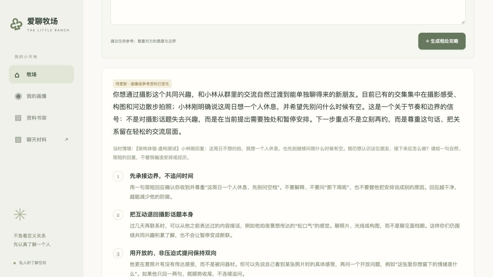

**E09–E10 的判断重点：** 本次情境是“对方这周日不想约拍，想独自休息，也不希望继续被追问何时有空”。短回复合适，但长期动机仍未知。更新画像后旧攻略待更新，证明界面已经表达了部分依赖关系。

本次真实模型调用共两次：生成一份带“架构体验·虚构测试”标记的攻略、更新一次示例画像。点击生成后约 36 秒在后续检查中看到结果，只能视为含工具间隔的观察上界，不能用作性能指标。尝试取消时任务已完成，**取消行为未完成端到端验收**。未验收：全格式文件上传、真实跨来源身份合并、长时持续同步、重启恢复、并发负载。

### 用一句话说明各对象的业务含义

| 对象 | 业务含义 | 必须避免的混淆 |
|---|---|---|
| 会话 | 一段有参与者的交流空间 | 会话数据库里的旧 `person` 命名不代表跨会话人物 |
| 来源成员 | 某来源、账号、会话中的发言身份 | 同名不等于同一个现实中的人 |
| 人物 | 用户持续关注的一个人，以及相处目标 | 人物不应等同于一个永久运行的 Agent |
| 材料 | 原话、用户自述、用户报告、背景等可检查输入 | 背景和旁人的话不能作为目标本人直接事实 |
| 画像 | 有依据、有限定、可能过期的认识 | 不是事实源，也不是心理诊断或永久人格标签 |
| 本次情境 | 这一次希望解决的具体问题 | 不自动成为经确认的长期人物材料 |
| 攻略 | 在当前约束下可选择的行动建议 | 生成、复制、采纳自报与外部实际发送不同 |
| 书架 | 帮助组织行动的方法知识 | 方法不能证明某个人有特定意图 |

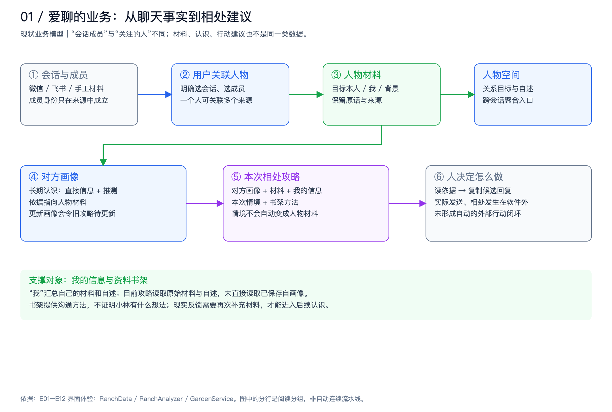

**业务闭环目前到哪里：** 软件负责收集、解释、提出候选建议；人负责决定和外部行动。旧会话的采纳流程可记录“用户自报已发送”，也不构成发送平台的回执。现实变化需要再次导入或补充，才会影响后续认识。未来如果增加反馈，应明确是用户自述、导入原文还是平台回执，不让模型把“建议做过”当成“实际做过”。

## 2. 当前技术架构：先说明系统实际上怎么运行

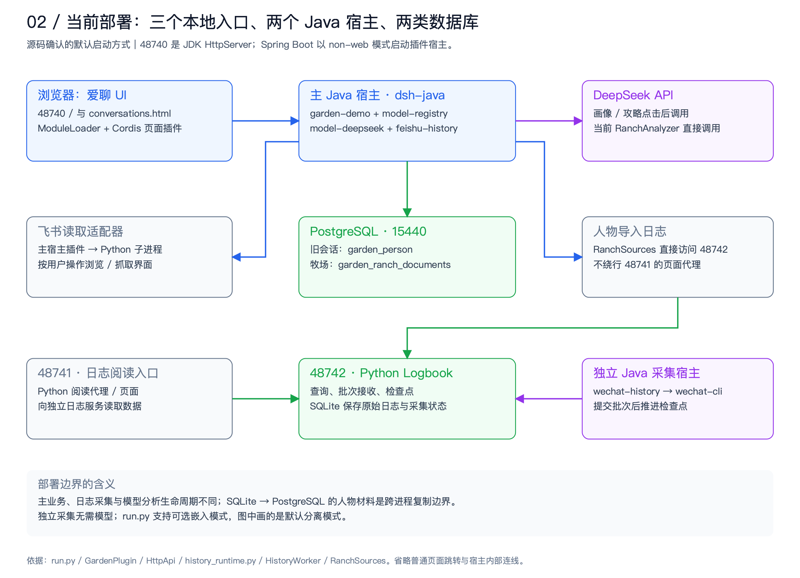

主程序不是典型的 Spring MVC 应用。`run.py` 用 Spring Boot 的 non-web 模式启动 dsh-java；`GardenPlugin` 自建 JDK `HttpServer` 承接 48740 的业务 HTTP 请求。当前启动器装配 model-registry、model-deepseek、feishu-history、garden-demo 四个插件。微信历史采集默认由另一份 dsh-java 宿主装配 wechat-history，数据进入 48742 的 Python Logbook 与 SQLite；48741 提供阅读入口。主业务导入人物材料时直接调用 48742。

这张图描述当前源码默认装配方式。可选嵌入历史采集模式也存在；本轮未重启并对所有启动分支逐一验证。源码配置、进程状态、界面效果是不同证据层次。

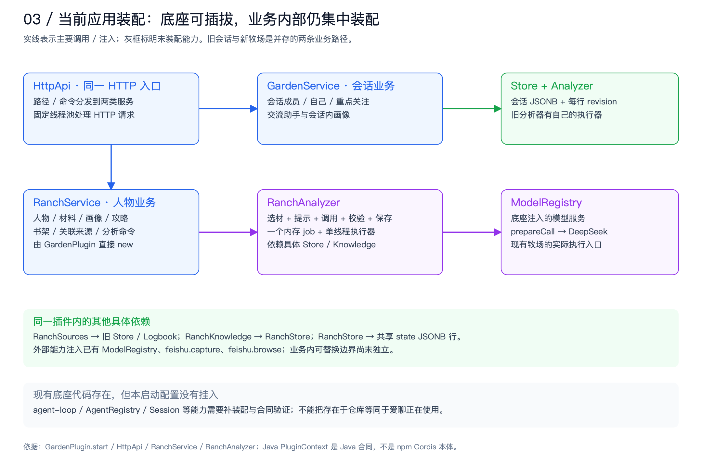

| 层次 | 当前实现 | 架构上的含义 |
|---|---|---|
| 前端外壳 | ModuleLoader 加载 ranch-ui 或 garden-ui；真实 Cordis Context 加载插件 | 已有模块生命周期基础，不需要为了模块化改换整个前端框架 |
| 页面状态 | `ranch-ui.js` 持有草稿、轮询与事件；整体重绘 | 页面内部职责集中；页面插件、数据服务和任务订阅可以继续拆分 |
| 接口 | HttpApi 分发 RanchService 与 GardenService | 同一入口下并存两种业务模型；应建立明确的兼容边界 |
| 旧会话存储 | `garden_person` 每个对象一行 JSONB，带 revision | 名称偏“人物”，实际语义是旧会话聚合，迁移时需要翻译 |
| 牧场存储 | `garden_ranch_documents` 的 state 行保存人物、自己、书架元信息 | 全牧场共享一个修改冲突域；历史增长也进入大文档 |
| 书籍内容 | 同表独立 `book:<id>` 文档 | 元信息和正文跨写入步骤，不是一笔统一事务 |
| 模型分析 | 自有 RanchAnalyzer 直接 ModelRegistry.prepareCall | 模型入口来自底座，但任务编排、提示、校验与提交集中在应用类 |
| 原始日志 | Logbook SQLite；有批次和检查点协议 | 已有可靠采集基础，应保留；人物投影边界尚未具备同等版本协议 |

### 已经值得保留的架构基础

现有代码并非没有架构：插件拥有资源清理动作，微信采集有目录锁和批次确认，人物画像输入会物理分离本人证据与周边背景，存储有乐观锁，生成保存前有版本检查，取消有 token/状态校验，书摘引用与人物证据也分开了。优化应把这些局部约束扩展为一致的业务协议，而不是推倒重来。

微信 `HistoryWorker` 先读取已提交检查点，采集有限批次，向 Logbook 提交成功后才继续；失败时保留 pendingBatch。这里已有幂等与确认意识。真正需要补齐的是 **Logbook / 旧会话 → 人物材料 → 派生结果** 这一段，而不是笼统地宣布“整个采集链路不可靠”。

源码定位见 S01–S06、S09、S10。

## 3. 核心业务流程：输入、转换、提交与失效

### 3.1 关联聊天的实际协议

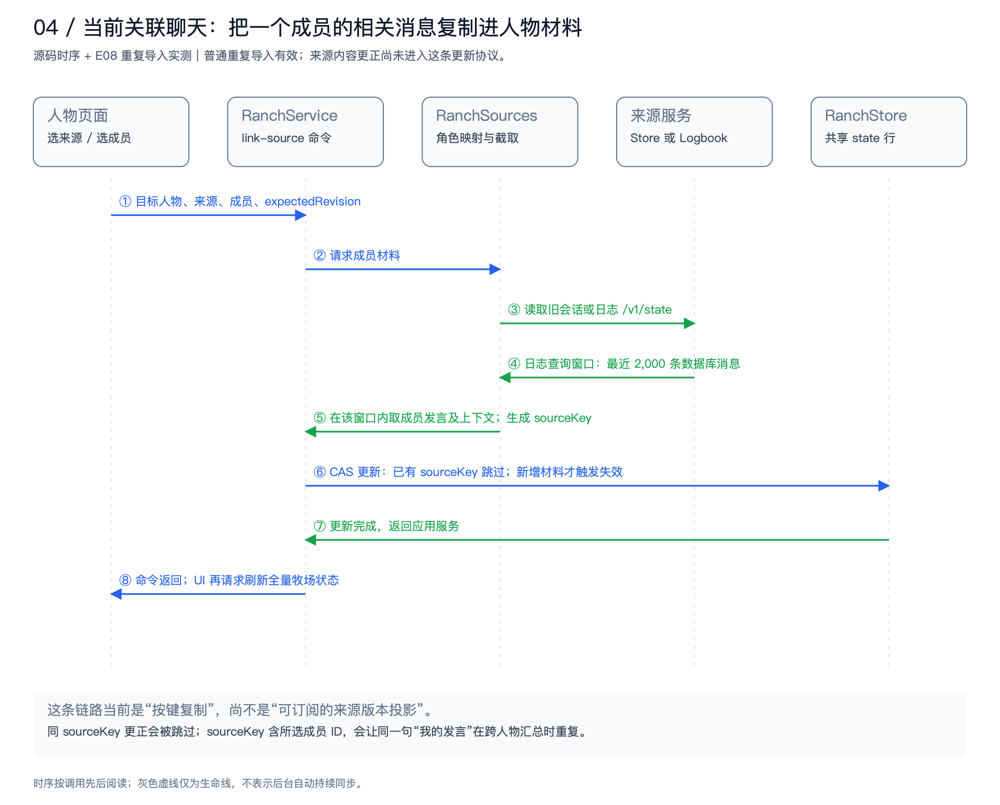

`RanchSources.select` 在读取到的消息窗口中寻找所选成员最近最多 300 条发言，并带上每条的前后相邻背景。这不是“最终总共最多 300 份材料”。来自 Logbook 的读取复用 `/v1/state`：其数据库查询窗口最近 2,000 条，窗口外的安静成员可能根本不出现；旧会话来源则读取自身有限存储。随后模型还会做另一轮 160 份 / 约 42,000 序列化字符选材。四层范围必须分别展示。

当前材料键拼接了“来源会话 + 所选成员 + 原消息”。它适合标记人物视角，但不适合标记原消息。`linkSource` 遇到已有 sourceKey 就跳过，没有比较原文的新版本，因此普通重复导入成功，不等于更正、删除同步成功。

另一个身份边界在 Logbook 适配器：当前导入将 `isMe` 设为 false。旧会话能根据 selfId 区分我与旁人，日志路径尚未使用等价的自我身份映射。后续应由 SourceAccount / ParticipantIdentity 映射决定角色，未知身份明确保留 unknown/context，不能猜成“我”。来源授权也应从固定来源名判断演进为显式 SourceScope 配置；新增连接器不能借此扩大既有授权范围。

### 3.2 画像与攻略的真实输入

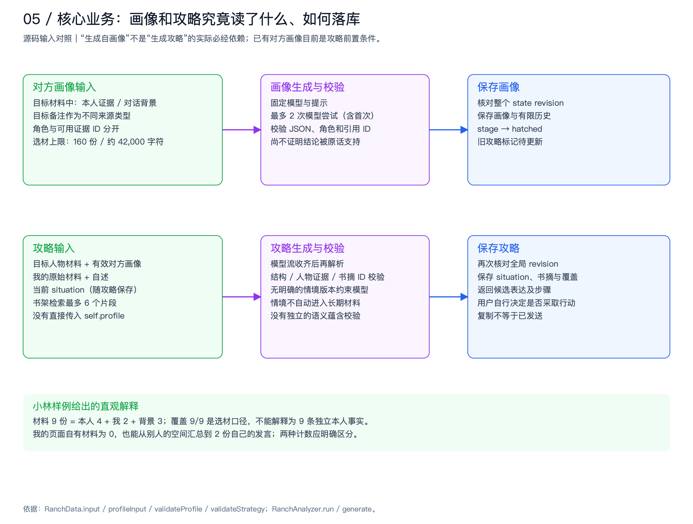

画像的证据归属约束比普通“把聊天交给模型”更严格：目标材料和 conversationContext 分开，引用必须属于 allowedProfileEvidenceIds。但这些程序校验主要检查结构、角色和 ID；无法仅凭 ID 合法推导语义正确。

攻略现在需要有效对方画像，传入目标材料、对方画像、我的原始材料/自述、本次 situation、最多 6 个书摘。**已生成的 self.profile 没有直接进入此输入。** 这不是必然的错误：原始信息可以降低摘要失真；但产品、文档、缓存和依赖声明必须与真正使用的输入一致。若以后引入自画像摘要，应把摘要作为找原文的索引，保留引用版本与反证，不能将它升级成独立事实源。

当前 situation 虽被保存进攻略，但不会自动进入人物材料，也没有细分为可版本化的“本次来信、已确认边界、用户意图”。建议保留这种显式确认边界，同时让一次分析内部始终使用冻结的情境快照。需要长期沿用的边界由用户确认后转为材料或约束记录。

### 3.3 为什么要把三套状态分开

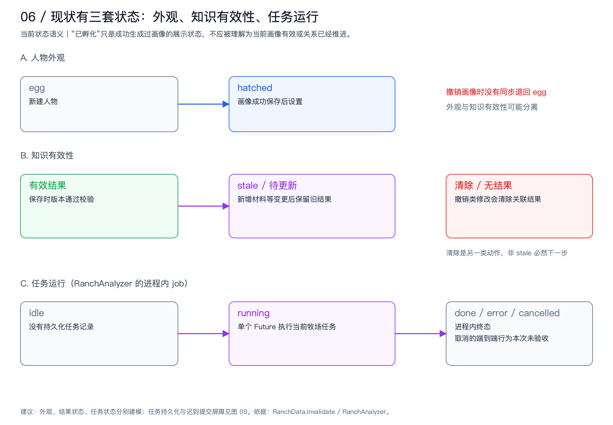

外观上的 hatched 表示曾成功保存画像；画像本身可能有效、待更新或被清除。当前 revoke 清空画像和历史，却不重置 stage。架构修复应先确定“孵化”到底代表经历还是当前有效性：若代表经历，UI 显式展示另一个有效性状态；若代表有效性，就让外观从有效画像派生。不能再让两个可独立修改的字段默默表达同一个概念。

同样，任务状态和结果状态不同。任务成功不保证结果永久有效；任务取消不应抹掉已有有效画像。RanchAnalyzer 的内存 job 只描述当前进程中的分析。旧 Analyzer 是另一套执行器，因此不能断言软件所有模型请求全局串行。

### 3.4 三个用例应有独立的依赖合同

| 用例 | 必需输入 | 可选输入 | 结果与不变量 |
|---|---|---|---|
| 更新对方认识 | 人物、经过确认的关联、本人证据、输入版本 | 周边背景、用户报告 | 每条主张绑定主体和原文版本；不知道就保留未知 |
| 更新自我认识 | 唯一原消息维度的自己的材料、自述 | 有限定的周边背景 | 同一句我的话跨人物出现，也只能算一次独立证据 |
| 生成相处建议 | 本次目标/情境、双方必要信息、已确认边界 | 有效画像、相关书摘 | 不虚构用户经历；方法不能推翻明确拒绝；提交时依赖仍有效 |

第三行是建议的用例合同，允许低信息量的“当下怎么回”不被完整画像阻挡。是否开放此新入口属于产品取舍；先把执行与依赖合同拆开，才能独立评估，而非在旧策略里再添加一连串条件分支。

## 4. 目标架构：业务事实、应用任务、模型执行分层

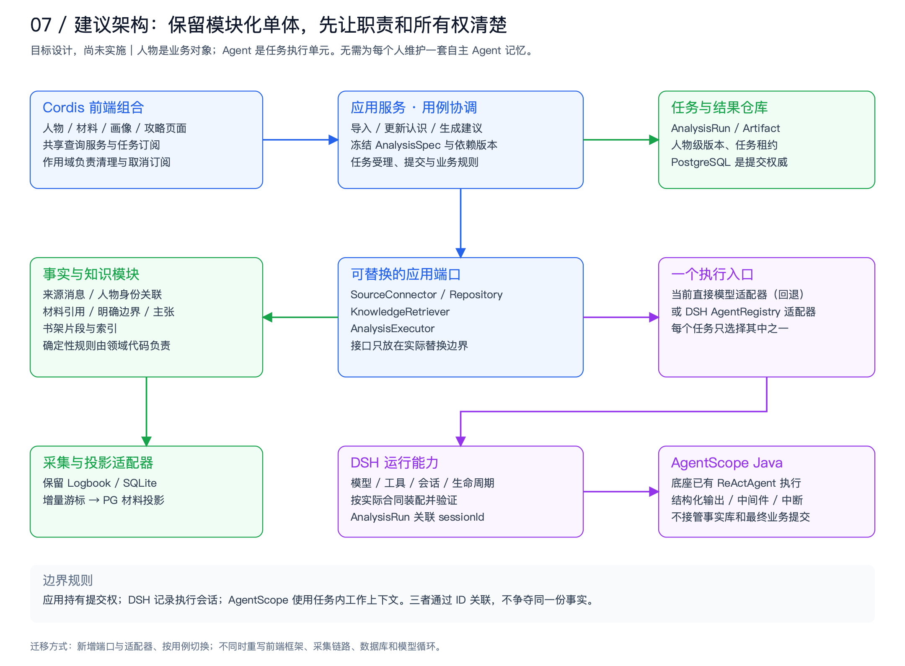

推荐继续采用模块化单体。当前规模没有证据支持引入微服务、Kafka、独立向量集群或默认多 Agent 协作。最需要的变化是按职责收敛代码与数据所有权，让现有本地进程之间有清楚协议。

| 业务模块 | 持有的数据和规则 | 对外能力 | 不应承担的工作 |
|---|---|---|---|
| 来源与身份 | 来源账号、成员身份、授权范围、跨会话关联 | 列成员、分页取消息、增量读取、身份确认 | 推测同名人物一定相同 |
| 事实与证据 | 来源版本、材料引用、角色、覆盖、撤销 | 给定人物与范围构建 EvidenceSet | 模型重试、页面重绘 |
| 人物认识 | 主张、支持与反证、有效期、画像版本 | 合成画像、检测依赖变化 | 把模型会话摘要当原文 |
| 情境建议 | 本次情境、关系目标、边界、建议版本 | 构建 AdviceSpec、校验候选 | 自动外发、冒充已行动 |
| 方法知识 | 书籍、片段、启停、检索与删除 | 提供带定位和版本的片段 | 证明人物事实 |
| 分析任务 | 幂等键、状态、预算、依赖、提交权 | 受理、调度、取消、重试、提交 | 永久保存另一套未经治理的人物记忆 |

### 4.1 只抽真正需要替换的端口

下面是建议的应用合同示意，不是声称底座已经提供的 SDK API。

```text
SourceConnector.read(SourceScope, Cursor) -> SourceBatch + Coverage
EvidenceRepository.snapshot(PersonId, SelectionPolicy) -> EvidenceSet + Versions
KnowledgeRetriever.search(Query, BookScope, Budget) -> VersionedPassages
AnalysisExecutor.execute(AnalysisSpec, Cancellation) -> Candidate + RunEvents
ArtifactCommitter.commit(RunId, LeaseEpoch, Dependencies, Candidate) -> CommitResult
```

`AnalysisSpec` 应不可变，至少包含用例类型、人物 ID、本次情境快照、证据选择结果、目标/自述版本、提示与 schema 版本、执行器版本、模型配置、工具范围与总预算。领域校验不依赖某个模型 SDK；模型适配器不自行保存画像。

事实读取、任务创建和结果保存均由应用服务协调。最终校验后的结果只有一个提交入口；工具默认只读，通过任务范围限制可读人物、来源与书籍。未来若开放写工具，也应返回待提交意图，由应用事务批准并保存。

### 4.2 最小的数据拆分

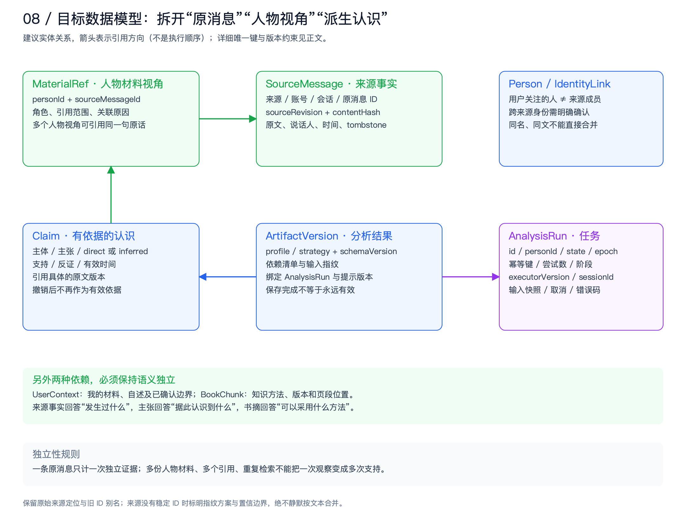

| 实体 / 关系 | 建议唯一性或版本约束 | 修复什么问题 |
|---|---|---|
| SourceMessage | `(sourceType, accountId, conversationId, nativeMessageId)`；单调版本或可判重事件版本 | 同一原文被多个视角复制；同 ID 更正丢失 |
| ParticipantIdentity / IdentityLink | 来源成员与人物的显式关联；记录谁确认、何时确认 | 会话内身份和跨会话人物混淆 |
| MaterialRef | `personId + sourceMessageId + 引用范围/用途`；角色与关联版本独立 | 材料视角变化不应创造新事实 |
| Claim / ClaimEvidence | 主体、主张类型、支持/反证、原文 ID 与版本、适用时间 | 引用存在但不能解释主张为什么成立 |
| ArtifactVersion / Dependency | 人物、结果类型、版本、状态、依赖清单 | 错误的全局失效或过期结果覆盖 |
| AnalysisRun | 幂等键、任务状态、租约 epoch、输入指纹、执行器版本 | 重复点击、重启丢任务、迟到提交 |
| Book / Chunk / IndexVersion | 文档与片段稳定 ID、内容版本、索引版本、启停版本 | 引用定位和索引/删除一致性 |
| UserContext | 自述版本、唯一原消息引用、经确认边界 | 自我证据重复；建议依赖不清 |

图中只绘核心引用，未铺开所有 personId、bookId 外键。初期无需把每个 JSON 字段全部关系化：先拆人物、自己、书架配置与任务行，并保留版本化 JSON 结果；先消除错误冲突域，再依据查询需求拆主张和依赖关系。

没有稳定原消息 ID 的来源，应声明能力降级，可使用带来源范围的指纹与人工核对；相同文本绝不能直接证明是同一条消息。消息从读取窗口消失不等于删除。只有明确撤回/删除事件、用户删除动作或可证实的完整对账才能产生 tombstone。

### 4.3 更新、失效和提交必须形成同一协议

来源变化有两种后果，不能混用：更正导致依赖结果需要重算；删除/撤销还要求移除不应继续展示的原文和派生引用。依赖图按原消息、自己的信息、关系目标和书籍片段定向传播，不再“任何变更都使全牧场冲突”。

新增材料是否影响既有结果，与该结果是否声称覆盖最新材料有关。仅记录“本次用过的 ID”不够：对于“总结截至现在”的画像，还应记录人物 evidence-set 版本或选择范围版本。对只回答固定来信的任务，可以使用更小依赖集合。检索也一样：若要求使用当前启用书架，检索目录/启停版本也是依赖，不能只记录已选中的六个片段。

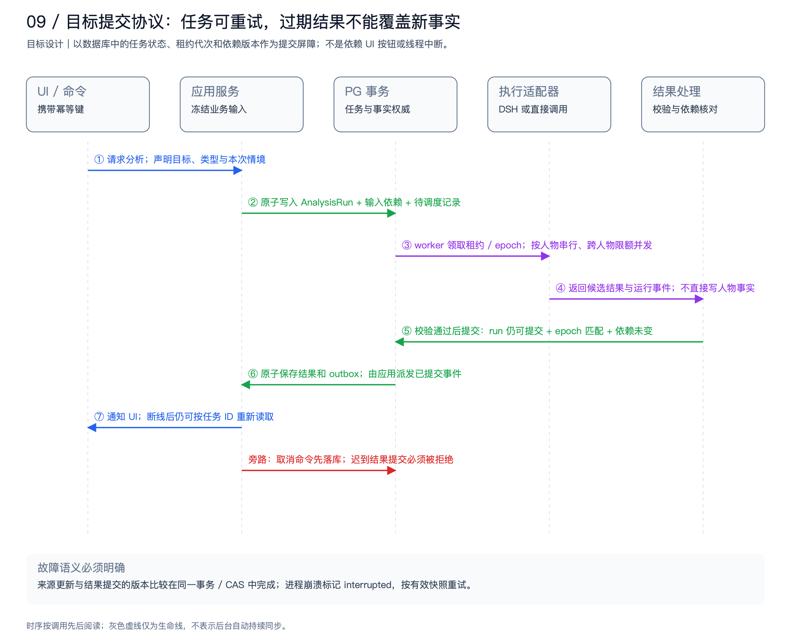

提交事务同时检查：任务仍可提交、租约 epoch 匹配、实际依赖及选择范围版本未变，然后保存结果、任务终态和 outbox 记录。来源更新也要在同一 PostgreSQL 事务中更新相关版本；否则先读版本再保存仍有检查与使用之间的竞态。保存后才发事件。事件丢失时 UI 可按任务 ID 重新读取，事件不是唯一事实。

跨 SQLite 与 PostgreSQL 不宣称分布式原子事务。连接器按游标读取、以事件 ID 幂等投影，PG 提交后再推进消费游标；失败可重读，不能漏过尚未提交的更新。同一 PG 中才使用 transactional outbox 关联业务提交和待通知记录。初期用轮询 worker 即可。

取消分两步：先将不可提交的取消状态持久化，再尽力中断模型请求。执行器即使不能立即停止耗费，迟到结果也不能再写入画像。租约过期后的旧 worker 同样受 epoch 屏障约束。重启后 running 任务转 interrupted，核对输入后按幂等任务重做未提交阶段，不承诺从某个 token 位置继续流式生成。

## 5. 设计模式怎样落在具体代码上

| 模式 | 爱聊中的具体落点 | 解决的问题 | 实施边界 |
|---|---|---|---|
| Ports and Adapters（端口与适配器） | RanchSources、RanchKnowledge、RanchAnalyzer 的外部依赖边界 | 来源、检索、执行器难替换，测试依赖整套应用 | 不给每个普通数据类都建接口 |
| Anti-corruption Layer（语义转换层） | 旧 GardenService / Store 与新人证据模型之间 | 旧 person 命名、成员角色、时间和 sourceKey 语义渗入新模型 | 保留原始字段，显式转换未知角色与时间精度 |
| Strategy（策略） | EvidenceSelectionPolicy、PromptProfile、ModelPolicy、RetrievalPolicy | 固定选材、提示、模型配置揉在分析器中 | 策略配置版本化，不能由资料内容任意更改 |
| Specification / Policy chain | 结构、主体、引用版本、明确边界、条件语义核对 | ID 合法不等于结论成立 | 确定性规则先执行；模型核对仅在有收益的场景启用 |
| State Machine（状态机） | AnalysisRun 的 queued/running/validating/committing/终态 | Future 与 UI 状态不能描述恢复、取消竞争 | 转移有条件、可持久化；结果有效性是另一套状态 |
| Repository + Optimistic Lock | Person/UserContext/BookCatalog 分别持久化、分别 CAS | 全局 revision 带来无关冲突 | 不能简单拆锁而丢掉跨依赖提交一致性 |
| Transactional Outbox + Idempotent Consumer | 来源投影后通知失效；任务提交后通知 UI | 提交成功但通知丢失、重复消费 | 单数据库事务内成立；跨库是可重读的至少一次投递 |
| CQRS-lite（轻量读写分离） | 首页摘要、人物详情、材料分页、任务状态独立查询 | 全量 state 轮询和整文档读取放大 | 同一个应用和数据库即可，不引入事件溯源平台 |
| Scoped ownership / 依赖注入 | Cordis 页面 scope 与 Java PluginContext.own | 页面卸载、插件重装留下订阅和执行器 | 清理前端订阅不自动取消用户希望继续的后台任务 |
| Strangler（渐进替换） | 旧来源 facade、版本化仓库、按用例选择执行器 | 大改时无法对照与回退 | 每类写入只有一个权威入口，不盲目双写两套事实 |

这些模式有先后关系：先有 SourceMessage 与依赖语义，再做版本锁和 outbox；先有 AnalysisExecutor 合同，再接框架；先有任务身份，再做订阅和可恢复 UI。反过来先换执行框架，会把现有业务歧义封装进更复杂的系统。

## 6. Cordis、DSH、AgentScope 的具体使用方案

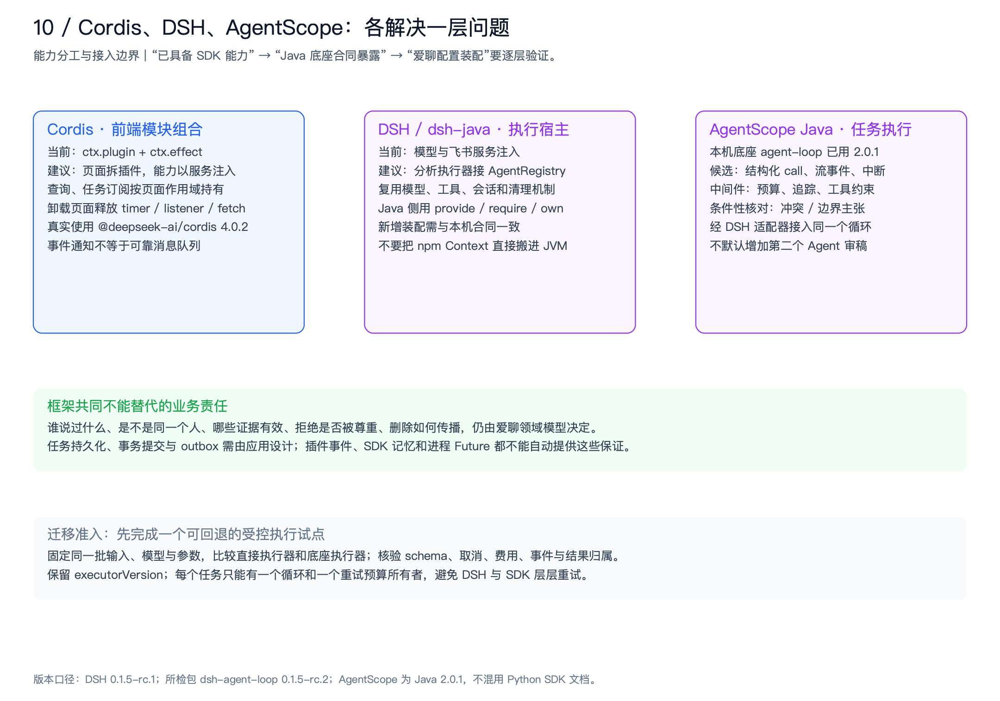

### 6.1 Cordis：把已有的前端插件能力用完整

当前 `host.js` 确实从 `@deepseek-ai/cordis` 创建 Context，页面通过 `ctx.plugin` 加载，`ctx.effect` 持有 mount 的释放函数。本机包版本 4.0.2。建议把 ranch-ui 内的“页面渲染、查询缓存、任务监听、证据展开”拆成少量有明确服务依赖的插件。

| 前端插件 / 服务（建议命名） | 服务与生命周期 | 验收行为 |
|---|---|---|
| ranch-api | 提供查询/命令客户端；统一携带命令幂等键与错误码 | 不同页面复用协议，错误可关联 runId |
| task-observer | 提供任务订阅和重连；根或任务范围持有 | 切换人物不重复建立监听；重新打开仍能读任务状态 |
| person-page | 依赖人物查询与任务观察；页面 scope 持有监听 | 页面卸载清理 listener/timer/未完成的页面读取 |
| evidence-panel | 展开原文、来源版本与支持/反证 | 不把引用背景与本人证据混为一种卡片 |
| knowledge-page | 管书籍状态与检索解释入口 | 书籍删除后不能继续打开旧正文缓存 |

以当前 fork 的 `provide/inject` 服务机制和作用域 effects 为准，先做两个页面及一个共享服务的接线验证。`isolate` 可以隔离服务实例绑定，不能被当作安全沙箱。Cordis 事件适合“任务更新了”的通知，不提供事务投递或持久任务保证。

前端的离开页面只意味着不再观察，不默认取消后台分析。真正的“取消任务”应走显式命令。页面级 AbortController 与业务级 CancellationToken 必须分开，避免一次导航丢掉长任务。

### 6.2 DSH / dsh-java：统一执行装配与生命周期

本机原生 DSH 为 0.1.5-rc.1，所检查的 dsh-agent-loop 包为 0.1.5-rc.2；爱聊后端使用工作区 dsh-java 的 Java 合同。Java `PluginContext.provide/require/own` 与 Cordis 设计思想相近，但不是在 JVM 中运行 npm Cordis。

建议 `garden-domain` 保持普通 Java 模块；需要单独替换/释放的 connector、retriever、analysis-executor 才成为插件服务。GardenPlugin 收敛为组合根：声明依赖、装配应用服务、注册 API、登记释放。业务方法不再直接决定 provider、构建线程池并拼接所有提示。

优先经已存在的 `AgentRegistry.create(ownerCtx, options)` 获取 AgentHandle；由该次任务的执行适配器持有句柄，结束时等待 `dispose()` 完成。现有合同的 `resume` 只提供交给工厂的恢复入口，不自动证明爱聊任务和结果能恢复。还需接入实际 Session/投影/存储插件，并测试与 AnalysisRun 的关联。某些 PluginContext 默认方法尚未接通，不能看到方法名就依赖其完整语义。

官方 DSH 架构强调服务、事件、作用域与可撤销副作用；当前官方主线仍处开发预览，不能把 master 示例直接当成本机 Java 合同。[DeepSeek Harness 官方架构](https://github.com/deepseek-ai/deepseek-harness/blob/master/docs/architecture.md)

### 6.3 AgentScope：通过已有循环承担受控任务

本机 `AgentScopeRuntime` 已实际构建 `io.agentscope.core.ReActAgent`，接入 DshModelAdapter、工具桥接、中间件和 hook，Java 依赖为 2.0.1。**当前爱聊启动配置没有装入这条 agent-loop 路径**；“底座具备”与“应用正在使用”必须区分。

| 能力 | 建议用法 | 接线前必须验证 |
|---|---|---|
| 结构化输出 | 固定 profile/strategy schema 的候选输出；领域校验继续保留 | Java SDK 的结构化 call 如何穿过 DSH 业务合同，不能假设已全部暴露 |
| 运行事件 | 转成选材、检索、生成、校验、提交等公开阶段 | 框架事件与业务阶段如何映射；不展示内部推理文本 |
| 中间件 | 执行预算、trace、工具范围、调用指标 | 本机桥接实际支持的钩子、顺序和异常处理 |
| 中断 | 连接取消信号，并配合应用提交屏障 | 下游是否停止与结果是否禁止保存分别验收 |
| 有限工具调用 | 在指定人物、来源、时间范围中找证据；检索书摘 | 工具是只读且范围受限；不能通过自然语言扩大授权 |
| 条件核对 | 仅对明确边界、矛盾材料、关键动机推断增加核对 | 质量收益、额外成本与延迟；失败后保守降级 |

这些 SDK 能力有官方 Java 2.0.1 文档支撑，但是否被本机 DSH 适配层完整暴露仍需试点。[AgentScope Java Agent](https://raw.githubusercontent.com/agentscope-ai/agentscope-java/v2.0.1/docs/v2/en/docs/building-blocks/agent.md) · [AgentScope Java Middleware](https://raw.githubusercontent.com/agentscope-ai/agentscope-java/v2.0.1/docs/v2/en/docs/building-blocks/middleware.md)

一次任务只有一个执行循环和一个总重试预算所有者。底座已有 AgentScope，就不要再在 RanchAnalyzer 外面包第二层 ReAct。简单固定输入的画像任务可以继续走直接模型适配器，是否转入 AgentScope 应由可观测性、工具需求和合同一致性收益决定；引入框架不是验收标准。

### 6.4 三种“记忆”的所有权

| 数据 | 权威位置 | 与其他层的关系 |
|---|---|---|
| 原始日志 | Logbook SQLite；手工或其他来源各有明确权威 | 人物侧保存带来源版本的投影/引用；纠正与撤销向下游传播 |
| 人物材料、确认关联、有效认识、建议 | 爱聊 PostgreSQL | 构建任务输入的业务权威；不由模型会话覆写 |
| 任务与提交记录 | 爱聊 AnalysisRun + Artifact | 关联 DSH sessionId，不以 session 是否存在代替任务终态 |
| 执行会话事件 | DSH 会话能力，按实际配置持久化 | 用于执行追踪与恢复；不能重新创造已撤销的事实 |
| AgentScope 上下文 | 当前任务的工作上下文 | 可从允许的数据重建；不形成无限期、不可撤回的平行人物档案 |

执行追踪应优先保存 ID、版本、阶段和计量；若必须保留正文，继承原数据的访问与删除策略。用户删除来源后，历史会话、工具缓存和向量索引不能成为“删除后又恢复原文”的后门。

## 7. 完整修复清单：从根因到落点和验收

优先级表示实施依赖与业务风险，不是生产事故等级。下列多数是目标方案，未声称已经修复。R01–R03 有实际复现或生成观察支撑；其余明确依据源码与架构分析。

### R01 · P0：建立来源更新与撤销协议

**现状与根因：** `RanchData.linkSource` 只按 sourceKey 判重；同一来源 ID 的更正不会替换文本，也不让画像过期。纯内存探针已复现。

**修复：** SourceConnector 输出 stableId、sourceRevision/contentHash、changeType、cursor、覆盖范围；EvidenceRepository 按版本 upsert，写入/撤销关联并更新 evidence-set 版本；同事务记录失效事件。连接器不能确认删除时保留“未知”，不因窗口缺席而删除。

**模式与框架：** 端口适配器 + 幂等消费者 + 单库 outbox；Cordis 展示来源状态；DSH 管连接器生命周期；AgentScope 不参与消息同步判重。

**验收：** “周日有空”被同 ID 更正为“周日没空”，原消息版本推进、材料更新、相关结果过期；重放同事件不再变化；窗口滑动不删旧材料；明确删除传播到引用、检索和缓存。回退时保留新增版本字段和 tombstone，不能重新显示被撤销内容。

### R02 · P0：分离原消息身份、人物关联与说话人角色

**现状与根因：** `RanchSources.select` 把所选成员写进消息键；`RanchData.input(self)` 按材料 ID 去重，导致同一句“我的发言”关联 A、B 后累计两次。日志来源的 isMe 还缺少自我身份映射。

**修复：** 新增 SourceMessageId、PersonLinkId、MaterialRefId；自画像和独立证据计数按 SourceMessageId 去重；账号自我身份和成员映射独立保存。旧键保留 alias，依据来源字段可确定时才回填/归并，无法确定的进入待核对列表。

**模式与框架：** 语义转换层 + Repository；Cordis 提供身份确认界面；DSH/AgentScope 使用已经解析好的主体，不自行猜测合并。

**验收：** 同一原文被两人物视角引用，独立证据仍为 1；两个账号中的同文消息不能误合并；未知说话人不进入本人直接证据；修复前后能追溯旧材料 ID。

### R03 · P0：把证据与边界约束变成可检查的领域结果

**现状与根因：** 合法 evidenceId 可以配上相反结论而通过结构校验；实测情境下，短回复合适，长分析仍有证据不足的动机判断。

**修复：** 输出主张级 subject、claim、kind、引用片段及版本、支持/反证与适用时间；引入结构 → 主体 → 引用有效性 → 明确约束 → 条件语义核对的校验链。未证实的动机删去或标未知，不能只加“可能”就默认可用。对于本次来信的明确拒绝，建议应以“尊重当前边界、等待对方主动或明确变化”为条件，避免无依据安排固定再次追问时间。

**模式与框架：** Specification / Policy；AgentScope 中间件负责运行约束，条件性核对负责候选语义，最终接受仍是业务规则。工具和书籍都不能覆盖已确认边界。

**验收：** 包括请求方向颠倒、将旁人经历当目标经历、把计划当承诺、拒绝后继续追问等标注样例。确定性不变量必须全部通过；语义质量由离线盲评统计，不宣称可被规则完全证明。失败返回缺口或保守候选，不保存为确定认识。

### R04 · P1：缩小冲突域，同时保留跨依赖原子提交

**现状与根因：** state 行包含所有人物、自述和书架；分析冻结全局 revision，A 的结果会被无关 B 的修改阻挡。

**修复：** 拆 PersonRevision、UserContextRevision、BookCatalogRevision、EvidenceSetRevision；结果携带实际使用与选择范围的依赖清单。提交在同事务中核验相关版本，不能先读再无条件写。自己的信息或已用书摘发生变化时，相关攻略仍必须被阻挡或标旧。

**模式与框架：** Repository + 乐观锁 + 依赖清单；框架不会自动决定业务冲突范围。

**验收：** 分析 A 时修改 B 不使 A 失败；修改 A 的引用材料必须拒绝旧提交；相关自述改变会影响相应攻略；只改头像不应令语义分析失效。并发测试必须覆盖检查与提交之间的变更。

### R05 · P1：持久任务、取消屏障与恢复协议

**现状与根因：** 内存 job/Future 不能在重启后重建任务意图、阶段和提交权。当前进程内已有取消保护，但没有持久化恢复语义。

**修复：** AnalysisRun 记录状态、幂等键、输入快照、epoch、尝试数、预算、执行器版本、错误分类；同人物写任务串行，不同人物限额并发。租约恢复、取消与完成以数据库条件更新裁决。错误区分来源不可读、资料变化、校验失败、模型超时、用户取消。

**模式与框架：** 状态机 + 幂等命令 + 提交屏障；DSH 提供运行会话和清理入口；AgentScope 提供执行与中断；任务持久化由应用完成。

**验收：** 重复点击只受理一个逻辑任务；取消后模拟迟到返回不能提交；旧 epoch worker 不能覆盖新结果；杀进程后显示 interrupted 并可安全重试；不得把取消旧任务误作用于新任务。

### R06 · P1：用专门查询协议解决覆盖与增量问题

**现状与根因：** 人物来源复用日志展示快照，静默截断传播到成员目录、材料和分析；UI 又轮询全量牧场。

**修复：** 提供独立成员目录、按成员/时间分页消息、增量 change cursor 与 completeness；引入 QueryFacade 输出首页摘要、人物详情、材料分页、任务增量。先保留任务小接口轮询，确有需要再用 SSE，断线仍可查状态。

**模式与框架：** CQRS-lite + SourceConnector；Cordis 页面订阅按 scope 清理；模型只拿显式 EvidenceSet。增量材料同步和自动调用模型是两个开关。

**验收：** 最近群消息窗口外但有历史的成员仍可查；分页无重漏；UI 显示源留存/关联/本次选用/本人证据/时间跨度；新消息到达只更新可用材料，不意外触发外部模型调用。

### R07 · P1：分别治理长期认识与短期建议

**现状与根因：** 现有攻略依赖有效画像；situation 保留在攻略中但不进入长期材料；外观 stage 又容易被误读为画像有效性。

**修复：** ProfileSpec 与 AdviceSpec 分开；冻结本次情境、边界与双方必要事实。允许低信息量的中性短回复作为独立用例；“加入材料”显式确认说话人、时间、来源性质。孵化外观与结果有效性使用分别定义的状态。

**模式与框架：** 用例分离 + 不可变值对象 + 状态机；DSH/AgentScope 使用不同执行预设，不要求两个长期 Agent。

**验收：** 新情境不会悄悄改写长期画像；确认补充后才推进事实版本；空画像也能在明确范围内提供中性答复；旧攻略待更新原因能定位到实际变更。

### R08 · P1：书籍、索引与引用形成一致生命周期

**现状与根因：** 当前固定窗口切片、词片重合打分并全量读启用书籍；元信息与内容写入靠补偿操作，删除和引用清理也跨步骤。未做真实召回率评测，不能断言向量一定更好。

**修复：** 小文档优先让元信息和正文版本在同一 PG 事务提交；若移到文件/对象存储，则先 staging、校验成功再发布可见版本。段落/章节优先切片；派生索引由 outbox 构建；可见版本与索引版本匹配；删除使索引、缓存、保留书摘引用一致失效。建立标注检索集，再决定关键词、混合检索或重排。

**模式与框架：** Repository + Outbox + Retrieval Strategy；DSH 注册检索服务，AgentScope 可调用受限检索工具；检索排序不应散落在 Agent 提示里。

**验收：** 失败上传不出现可用空书；正文未就绪不发布元信息；删除后不存在可打开的旧书摘；比较 Recall@k、引用定位正确率、延迟和成本后才切换检索器。

### R09 · P2：插件化与执行器适配，减少组合类的负担

**现状与根因：** GardenPlugin 在一个组合根内直接构建大部分类；RanchAnalyzer 同时承担输入选择、提示、模型、重试、校验和保存。

**修复：** 提取 AnalysisExecutor、PromptProfile、EvidenceSelector、ArtifactCommitter；前端拆少量服务插件；Java 只在可替换能力边界注册服务。先把当前执行器包装起来，再加 DSH 适配器，以同一合同进行基线对照。

**模式与框架：** 端口适配器 + Strategy + scoped ownership；Cordis 做前端依赖，Java PluginContext 做后端依赖；AgentScope 留在底座现有循环内部。

**验收：** 用例测试可以替换模型和来源；插件关闭后没有残余 listener/线程/请求；同一任务无重复循环和重试叠加；适配器故障可回退到明确版本，已开始的任务不静默换执行器。

### R10 · P1：可观测性与评测必须覆盖业务事实

**现状与根因：** 当前通用错误提示与异常类日志不足以解释来源失败、过期提交或语义失误；界面“覆盖”也不能代表质量。

**修复：** runId 贯穿命令、来源读取、选材、检索、模型、校验、提交；记录阶段时间、选材数/角色、引用版本、失败码、token 与费用。默认不记录原文和模型内部推理。建立版本化虚构/经授权脱敏样例与标注，改动提示、选择器和框架时用同一基线回归。

**模式与框架：** 应用领域事件 + DSH trace/session 关联 + AgentScope middleware；公开阶段由业务定义，不能只搬 SDK 事件名。

**验收：** 单个 runId 能解释结果为何未保存；能区分执行成功率和结果有效率；敏感正文不出现在一般错误日志。性能目标先测基线，再以产品约束设定，不使用本次人工 36 秒观察充当 SLA。

## 8. 迁移顺序、验收门槛和回退

| 阶段 | 交付内容 | 通过门槛 | 回退原则 |
|---|---|---|---|
| M0 · 固定业务契约 | 本报告的用例/主体/来源语义；保留探针与虚构评测集；记录现有行为 | 关键输入、输出、失效原因有可重复样例 | 尚未改数据，直接保留基线 |
| M1 · 修事实链路 | 稳定来源 ID、旧 ID alias、版本/撤销、角色与自我去重、覆盖协议 | R01/R02 确定性样例全部通过；迁移前后引用可追溯 | 不删除旧字段；未知数据隔离；撤销不可被旧读路径复活 |
| M2 · 修任务与一致性 | 拆冲突域、AnalysisRun、依赖清单、提交事务、outbox | A/B 并发、取消竞争、崩溃重启、重复事件均通过 | 先启兼容读层；旧执行器仍可用，但必须经过新提交屏障 |
| M3 · 插件与执行试点 | 包装当前执行器；接一条 DSH/AgentScope 受控建议路径；Cordis 服务拆分 | 相同输入/模型/参数下 schema、引用、取消、归属通过，费用延迟可接受 | 每 run 固定 executorVersion；新请求可切回，已有任务不双跑 |
| M4 · 按评测扩展 | 精准选材、混合检索、条件核对、渐进统一旧会话入口 | 质量提升有标注结果支撑，额外成本可解释 | 独立 feature flag，保留原检索/提示策略版本 |

数据迁移采用 expand → backfill → verify → switch → contract。先新增列/表与兼容读取，再按可证实的来源键回填，输出无法归并的清单；核对每人物材料数、唯一原消息数、引用可达率与撤销状态。**影子比对优先比较读取和确定性选择结果，不自动额外发送模型请求。** 切换写入权威只做一次明确切换，避免两个仓库各自继续更新。

回退不是重新启用会忽略 tombstone 的旧代码。M2 之后，即便模型执行器回退，版本检查、取消屏障和删除语义仍必须保留。收缩旧字段之前完成独立备份、迁移核对和恢复演练；本报告未执行任何迁移或备份操作。

### 评审时应看哪些数字

| 维度 | 建议指标 | 当前已知程度 |
|---|---|---|
| 事实正确性 | 同事件重放幂等率、错误合并数、过期提交拦截、撤销传播完整性 | 有 4 项内存探针；未有系统性基线 |
| 认识质量 | 主体归属、主张支持率、矛盾处理、独立证据计数、未知表达 | 有单次生成观察与反例；不能推导总体错误率 |
| 建议质量 | 明确边界遵守、虚构自述率、情境相关性、可操作性 | 需要人工标注集与盲评 |
| 执行可靠性 | 受理/提交成功率、恢复成功率、取消后提交数、重复任务数 | 未做恢复与并发验证 |
| 性能成本 | 各阶段 p50/p95、每成功有效结果 token/费用、查询数据量 | 需要应用计量，不能用页面观察推断 |
| 运维可解释性 | runId 可追溯率、错误分类覆盖、无正文常规日志 | 目前通用错误较多，需实现后验证 |

## 9. 证据、源码索引与评估边界

### 四个内存探针

探针使用当前构建产物中的真实业务类，在内存中运行，不调用外部模型、不修改数据库。结果文件位于 [probe-results.json](../evidence/probe-results.json)。

| 探针 | 实际结果 | 可以得出的结论 |
|---|---|---|
| 同来源 ID 更正后替换旧文本 | false | 当前关联逻辑没有处理同 ID 内容更正 |
| 同来源 ID 更正使画像过期 | false | 该更正路径没有进入失效传播 |
| 一句原始自我发言，关联两成员后计数 | 2 | 材料视角 ID 被当成原消息 ID 去重 |
| 相反主张引用合法 ID 通过结构校验 | true | 结构校验不验证语义支持，不代表实际模型的错误概率 |

### 主要源码索引

以下定位均为本次工作区读取的实现，不以旧 README 或旧验收文档替代当前代码。GitHub 文字版的应用源码链接已改为仓库相对路径；外部 dsh-java 源码不在此仓库。

| 索引 | 文件 | 支撑内容 |
|---|---|---|
| S01 | [GardenPlugin.java](../../src/main/java/dev/garden/GardenPlugin.java#L13) | 主应用组合根、注入和关闭 |
| S02 | [HttpApi.java](../../src/main/java/dev/garden/HttpApi.java) | JDK HTTP、路由、来源/跨站边界 |
| S03 | [RanchStore.java](../../src/main/java/dev/garden/RanchStore.java#L36) | 共享 state JSONB、revision、CAS |
| S04 | [RanchData.java](../../src/main/java/dev/garden/RanchData.java#L36) | 状态失效、选材、自我聚合、校验、sourceKey 去重 |
| S05 | [RanchSources.java](../../src/main/java/dev/garden/RanchSources.java#L100) | 来源读取、成员选材、角色与 ID |
| S06 | [RanchAnalyzer.java](../../src/main/java/dev/garden/RanchAnalyzer.java#L16) | 真实输入、内存任务、模型调用、保存、取消 |
| S07 | [RanchKnowledge.java](../../src/main/java/dev/garden/RanchKnowledge.java) | 书籍生命周期、切片与检索 |
| S08 | [GardenService.java](../../src/main/java/dev/garden/GardenService.java) | 旧会话语义、幂等操作、自报采纳 |
| S09 | [run.py](../../run.py) | 默认四插件装配、non-web 启动 |
| S10 | [HistoryWorker.java](../../plugins/wechat-history/src/main/java/dev/garden/wechat/HistoryWorker.java#L64) | 目录锁、检查点、批次提交和资源释放 |
| S11 | [Logbook store.py](../../logbook/store.py#L190) | SQLite 与最近 2,000 条查询 |
| S12 | [host.js](../../web/src/host.js) / [ranch-ui.js](../../web/src/ranch-ui.js#L20) | 真实 Cordis 加载、作用域、全量轮询 |
| S13 | `AgentScopeRuntime.java`（外部 dsh-java 源码） | 底座真实 ReActAgent 与模型/中间件桥接 |
| S14 | `AgentRegistry.java`（外部 dsh-java 源码） / `AgentHandle.java`（外部 dsh-java 源码） | 创建/恢复工厂入口、句柄和异步释放合同 |

**评估边界：** 图解区分界面实测、内存复现、源码确认和目标设计。此次重构的是评审交付物，没有修改产品源码、启动配置和依赖，没有重启服务，也没有执行数据库迁移。已真实生成的示例结果与历史记录保留在产品中；它们来自上一轮体验，本轮截图只读复查。
